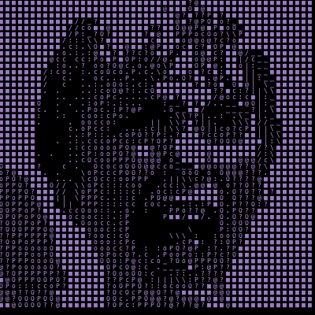

# ascii.js
An implementation of [Acerola's ASCII shader](https://youtu.be/gg40RWiaHRY?si=dtuT8gx82CBcsUr7]) written for HTML Canvas. Although this project would be better written in a shader language for the GPU (hopefully I will write that too at some point), I chose to do it in JS so that I can understand the math behind all the visual steps. Having to implement the guassian blur, difference of guassians, sobel operator, and base quantized shaders from scratch forced me to work through examples first on my own, turn them into tests, and then develop!

